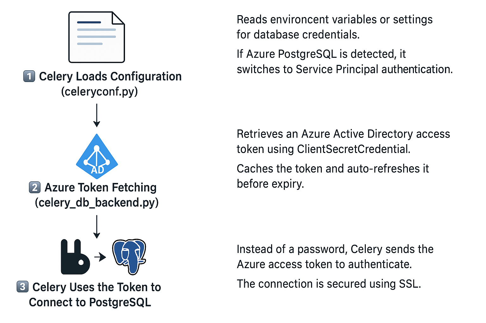

# Celery Configuration with Azure Service Principal for PostgreSQL Backend

## Overview
This setup enables Celery to store task results in Azure PostgreSQL while authenticating securely using Azure Active Directory Service Principal (SP).

- Instead of a static username/password, it retrieves an Azure AD access token dynamically.

- The token auto-refreshes every 60 minutes to maintain authentication.

- Logs are sanitized to prevent token exposure.

### Configuration Breakdown


```/var/www/oasis/
│── src/
│   ├── conf/
│   │   ├── assets/
│   │   │   ├── celery_flow.png
│   │   ├── celeryconf.py
│   │   ├── celery_db_backend.py  # Configures celery backend logic for authentication
│   │   ├── celery_readme.md  # Defining the custom DB Engine
│   ├── server
│   │   ├── oasisapi
│   │   │   ├── settings.py  # where we Configures database backend 
```

##### 1️⃣ celeryconf.py - Configuring Celery to Use Azure Authentication
This script sets up Celery’s result backend to use Azure PostgreSQL with an access token.

##### 🔹 Key Features:
- ✅ Automatically detects if PostgreSQL is the result backend.
- ✅ Retrieves the Azure Service Principal access token dynamically.
- ✅ Masks the token/password in logs for security.

##### 💻 Code Breakdown

```python
elif CELERY_RESULTS_DB_BACKEND.startswith("db+postgresql"):  
    # 🔹 Remove 'db+' prefix as Celery doesn't require it
    db_engine = CELERY_RESULTS_DB_BACKEND.replace("db+", "")

    # ✅ Get Azure Service Principal Credentials
    service_principal_user = settings.get("celery", "AZURE_SERVICE_PRINCIPAL_USER")
    azure_token = celery_db_backend.get_azure_access_token()  # 🔹 Fetch token
    db_host = settings.get("celery", "db_host")

    # ✅ Configure Celery to use Azure Authenticated PostgreSQL
    app.conf.result_backend = "{DB_ENGINE}://{SP_USER}:{DB_PASS}@{DB_HOST}:{DB_PORT}/{DB_NAME}".format(
        DB_ENGINE=db_engine,  # ✅ Uses 'postgresql+psycopg2'
        SP_USER=urllib.parse.quote(service_principal_user),  # 🔹 Use Service Principal Username
        DB_PASS=urllib.parse.quote(azure_token),  # 🔹 Use Azure AD Token
        DB_HOST=db_host,
        DB_PORT=settings.get("celery", "db_port"),
        DB_NAME=settings.get("celery", "db_name", fallback="celery"),
    )

    # ✅ Mask token for security in logs
    masked_backend = app.conf.result_backend.replace(urllib.parse.quote(azure_token), "**T*O*K*E*N**")

else:
    # Default to user/password authentication
    db_user = settings.get("celery", "db_user", fallback="user")
    db_pass = settings.get("celery", "db_pass", fallback="password")
    db_host = settings.get("celery", "db_host", fallback="localhost")
    db_port = settings.get("celery", "db_port", fallback="5432")
    db_name = settings.get("celery", "db_name", fallback="celery")

    app.conf.result_backend = f"{CELERY_RESULTS_DB_BACKEND}://{db_user}:{db_pass}@{db_host}:{db_port}/{db_name}"

    # ✅ Mask Password in Logs for Non-Azure DBs
    masked_backend = app.conf.result_backend.replace(db_pass, "**P*A*S*S*W*O*R*D**")

# ✅ Log Configuration
print("✅ Celery broker set to:", app.conf.broker_url)
print("✅ Celery result backend set to:", masked_backend)
```

##### 2️⃣ celery_db_backend.py - Handling Azure AD Token Authentication
This module is responsible for fetching Azure Active Directory access tokens and managing the PostgreSQL connection for Celery.

##### 🔹 Key Features:
- ✅ Uses Azure Identity SDK to authenticate via ClientSecretCredential.
- ✅ Caches the token and auto-refreshes it 5 minutes before expiration.
- ✅ Establishes a PostgreSQL SSL connection using the token as the password.

##### 💻 Code Breakdown

```python
from azure.identity import ClientSecretCredential
import psycopg2
import time  # To track token expiration

class CeleryDatabaseBackend:
    def __init__(self, settings):
        self.settings = settings
        self.credential = None
        self.token = None
        self.token_expiry = 0  # Stores expiry timestamp

    def get_azure_access_token(self):
        """
        Fetches and caches a fresh access token using Azure Service Principal credentials.
        Auto-refreshes when token is about to expire.
        """
        tenant_id = self.settings.get('celery', 'AZURE_TENANT_ID')
        client_id = self.settings.get('celery', 'AZURE_CLIENT_ID')
        client_secret = self.settings.get('celery', 'AZURE_CLIENT_SECRET')

        if not all([tenant_id, client_id, client_secret]):
            raise ValueError("Azure AD credentials are missing for Celery DB.")

        if self.credential is None:
            self.credential = ClientSecretCredential(tenant_id, client_id, client_secret)

        # Refresh token if expired or close to expiration
        current_time = time.time()
        if self.token is None or current_time >= self.token_expiry - 300:  # Refresh 5 min before expiry
            token_response = self.credential.get_token("https://ossrdbms-aad.database.windows.net/.default")
            self.token = token_response.token
            self.token_expiry = current_time + 3600  # Azure tokens last ~60 min

        return self.token

    def get_connection(self):
        """
        Establish a PostgreSQL connection for Celery using an Azure AD token.
        """
        conn_params = {
            "db_name": self.settings.get('celery', 'db_name'),
            "db_user": self.settings.get('celery', 'AZURE_SERVICE_PRINCIPAL_USER'),
            "db_pass": self.get_azure_access_token(),
            "db_host": self.settings.get('celery', 'db_host'),
            "db_port": self.settings.get('celery', 'db_port'),
            "sslmode": "require",
        }

        return psycopg2.connect(**conn_params)
```




<details>
  <summary>📌 Environment Variables Required (Click to expand)</summary>

| Variable Name                       | Description                                    |
|--------------------------------------|------------------------------------------------|
| `AZURE_TENANT_ID`                    | Azure AD Tenant ID                             |
| `AZURE_CLIENT_ID`                    | Azure Service Principal Client ID             |
| `AZURE_CLIENT_SECRET`                | Azure Service Principal Client Secret         |
| `AZURE_SERVICE_PRINCIPAL_USER`        | Username for PostgreSQL (e.g., `sp_user@db`)  |
| `CELERY_RESULTS_DB_BACKEND`           | Database backend (e.g., `db+postgresql`)      |
| `DB_HOST`                             | PostgreSQL database host                      |
| `DB_PORT`                             | PostgreSQL database port                      |
| `DB_NAME`                             | Celery result backend database name           |

</details>


#### Security Considerations

- ✅ Avoid storing credentials in plaintext – Always use Kubernetes Secrets or environment variables.
- ✅ Token auto-rotation ensures security – No static passwords are stored.
- ✅ Logs are sanitized – Azure tokens and passwords are masked before being printed.

#### Troubleshooting
- Error: Azure AD credentials are missing for Celery DB
- Ensure AZURE_TENANT_ID, AZURE_CLIENT_ID, and AZURE_CLIENT_SECRET are set correctly.
- Celery fails to connect to PostgreSQL
- Verify that the Service Principal is assigned the correct roles (db_owner or db_reader).
- Expired Token Error
- Restart the worker to refresh the token.

## Conclusion

This setup eliminates the need for database passwords, enhances security, and ensures seamless authentication with Azure PostgreSQL using Service Principal tokens
